# CIFAR10 Example

Requirements: PyTorch 1.12+ or 2.x, `pytorch_warmup`, `torchvision`, and `tqdm`.

> [!Warning]
> The NAdamW optimization algorithm requires PyTorch 2.1 or later.
> The RAdamW optimization algorithm requires PyTorch 2.3 or later.
> So, we recommend you use PyTorch 2.3.1 or later.

## Results

* The ResNet20 architecture is employed from
  [a ResNet implementation for CIFAR10](https://github.com/akamaster/pytorch_resnet_cifar10).
* The initial learning rate $\alpha$ is $10^{-1}$ or $10^{-2}$.
* Various optimization algorithms are used for comparison: SGD, AdaMax, AdamW, AMSGradW, NAdamW, and RAdamW.
  The momentum factor of SGD is set to $0.9$. The exponential decay rates of Adam variants are set as
  $\beta_{1} = 0.9$ and $\beta_{2} = 0.999$.
* Various warmup schedules are used for comparison.
  The untuned linear and exponential warmup are labeled as Linear and Expo, respectively.
  The RAdam warmup is labeled as RAdam.
  The linear and exponential warmup with a warmup period and a constant $\tau$ of *n* thousands
  are labeled as Linear-*n*k and Expo-*n*k, respectively.
* 5 random seeds are used to sample top-1 scores on the testing set.
  The mean scores are shown in figures below. The error bar indicates the standard deviation.
  The error band is used for reference purpose.

### No Warmup

<p align="center">
  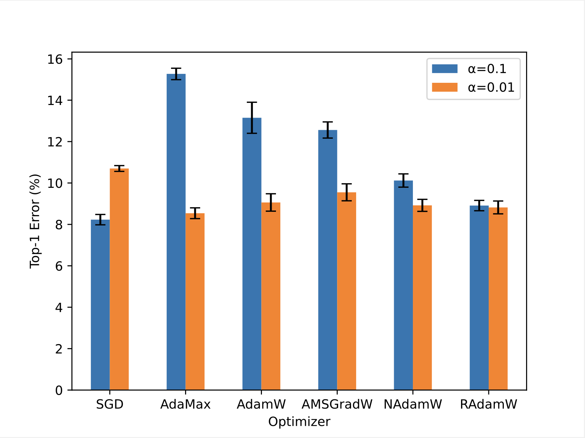</br>
  <i>Top-1 errors of models trained by each optimization algorithm without warmup.</i>
</p>

### AdamW

<p align="center">
  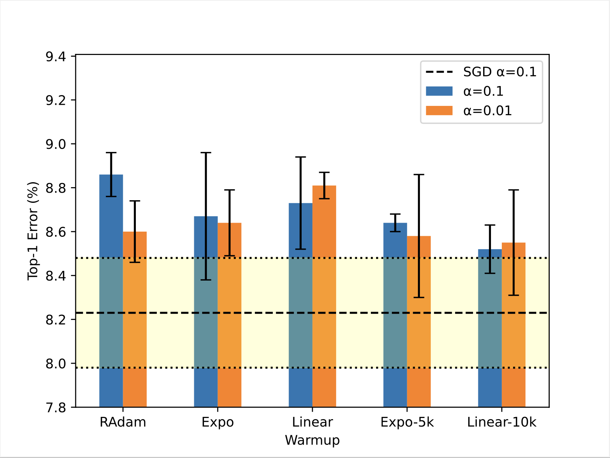</br>
  <i>Top-1 errors of models trained by AdamW with each warmup schedule.</i>
</p>

### AMSGradW

<p align="center">
  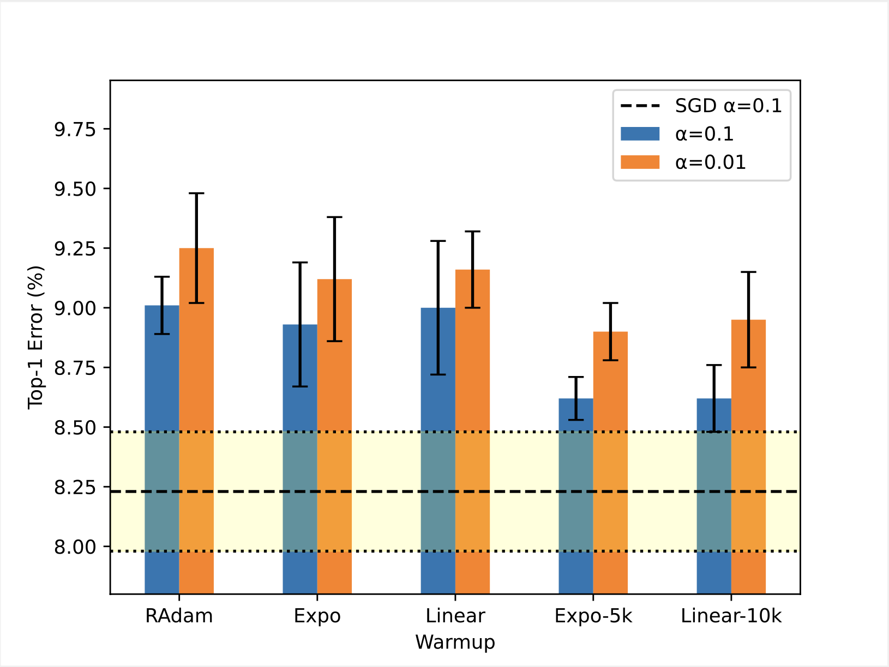</br>
  <i>Top-1 errors of models trained by AMSGradW with each warmup schedule.</i>
</p>

### NAdamW

<p align="center">
  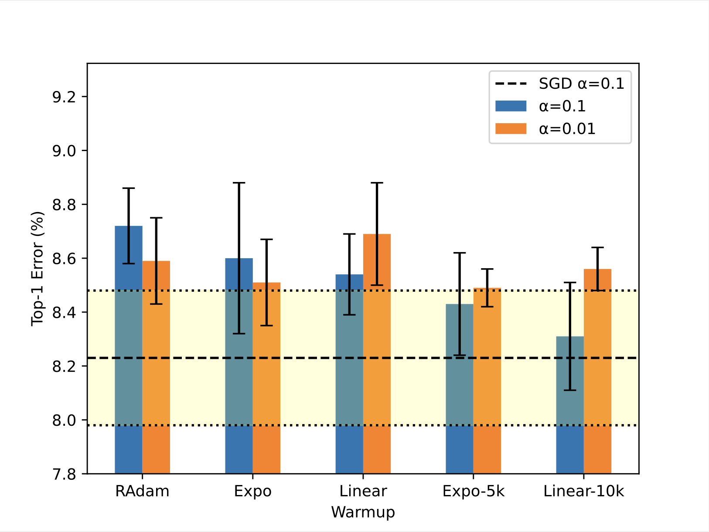</br>
  <i>Top-1 errors of models trained by NAdamW with each warmup schedule.</i>
</p>

### AdaMax

<p align="center">
  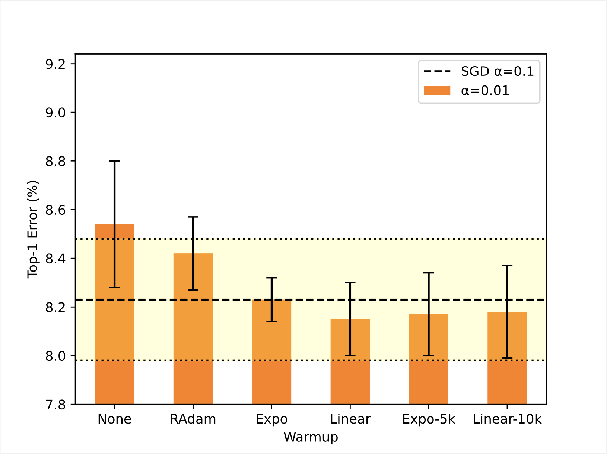</br>
  <i>Top-1 errors of models trained by AdaMax with each warmup schedule for &alpha; = 0.01.</i>
</p>

<p align="center">
  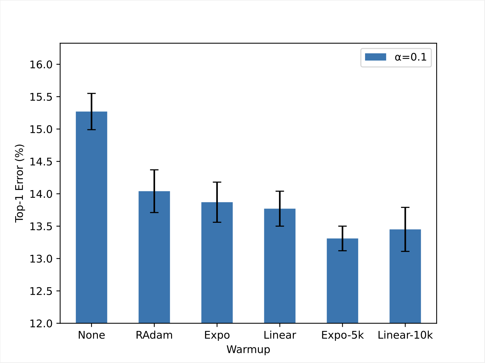</br>
  <i>Top-1 errors of models trained by AdaMax with each warmup schedule for &alpha; = 0.1.</i>
</p>

### AdamW for a smaller &beta;&#8322;

<p align="center">
  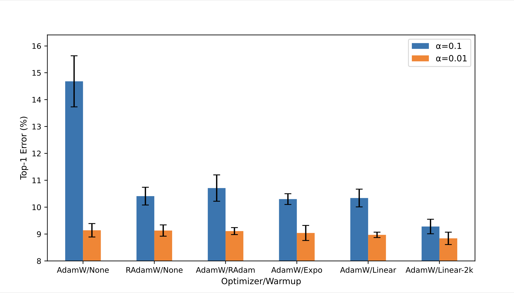</br>
  <i>Top-1 errors of models trained by AdamW/RAdamW without warmup or AdamW with each warmup schedule for &beta;&#8322; = 0.99.</i>
</p>

<p align="center">
  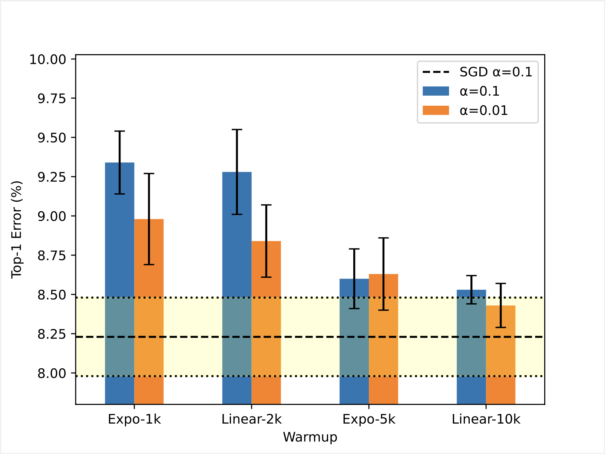</br>
  <i>Top-1 errors of models trained by AdamW with each warmup schedule for &beta;&#8322; = 0.99.</i>
</p>

## Download ResNet for CIFAR10

Run the Python script `download.py` to download
[a ResNet implementation for CIFAR10](https://github.com/akamaster/pytorch_resnet_cifar10):

```shell
python download.py
```

This script shows download progress:

```
Downloading https://.../resnet.py to ./resnet.py
100.0%
```

## Train ResNet20 Models

Run the Python script `main.py` to train a ResNet20 model on the CIFAR10 dataset using the SGD or AdamW algorithm.

> [!Note]
> Use `--workers` option to set the number of dataloader workers
> for a better performance in a GPU training.
> The optimal number depends on your environment.
> For example, 2 and 4 for an MPS and CUDA device, respectively,
> but it should not be more than the number of available performance cores.
> Note that the initial epoch takes more time than a later epoch if the number of workers is greater than 0.

The training log and the test evaluations are saved to files in the directory specified by `--output` option:

* `history.csv` - The training log.
* `evaluation.csv` - The test evaluations during training.
* `cifar10_resnet20.pt` - The best model (saved optionally).

You can visualize the training result using the Python script `plot.py`:

```
python plot.py [path to the directory]
```

This plot script requires `pandas` and `matplotlib`.

<p align="center">
  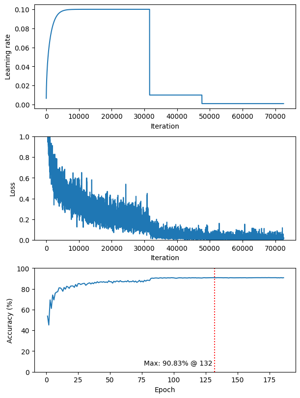</br>
  <i>A training result for the AdamW algorithm with the RAdam warmup.</i>
</p>

### SGD

Train a ResNet20 model using the SGD algorithm:

```
python main.py --output output_sgd
```

### AdamW

#### No Warmup

Train a ResNet20 model using AdamW without warmup:

```
python main.py --algorithm adamw --output output_adamw_none
```

#### Untuned Exponential Warmup

Train a ResNet20 model using AdamW with the *Untuned Exponential Warmup* schedule:

```
python main.py --algorithm adamw --warmup exponential --output output_adamw_expo
```

#### Untuned Linear Warmup

Train a ResNet20 model using AdamW with the *Untuned Linear Warmup* schedule:

```
python main.py --algorithm adamw --warmup linear --output output_adamw_linear
```

#### RAdam Warmup

Train a ResNet20 model using AdamW with the *RAdam Warmup* schedule:

```
python main.py --algorithm adamw --warmup radam --output output_adamw_radam
```

#### Expo-5k Warmup

Train a ResNet20 model using AdamW with the *Expo-5k Warmup* schedule:

```
python main.py --algorithm adamw --warmup exponential --warmup-period 5000 --output output_adamw_expo-5k
```

#### Linear-10k Warmup

Train a ResNet20 model using AdamW with the *Linear-10k Warmup* schedule:

```
python main.py --algorithm adamw --warmup linear --warmup-period 10000 --output output_adamw_linear-10k
```

## Usage

```
usage: main.py [-h] [-r ARCH] [-b BS] [-c BS] [-e NE] [-m M [M ...]]
               [-a ALGO] [-l LR] [-d WD] [-g B2] [-w WU] [-t TAU]
               [-n NW] [-s S] [-i I] [-o PATH] [--save-model]
               [--no-progress] [--no-gpu]

PyTorch CIFAR10 Example

options:
  -h, --help            show this help message and exit
  -r ARCH, --arch ARCH  ResNet architecture for CIFAR10: resnet20 |
                        resnet32 | resnet44 | resnet56 | resnet110 |
                        resnet1202 (default: resnet20)
  -b BS, --batch-size BS
                        input batch size for training (default: 128)
  -c BS, --test-batch-size BS
                        input batch size for testing (default: 1000)
  -e NE, --epochs NE    number of epochs to train (default: 186)
  -m M [M ...], --milestones M [M ...]
                        MultiStepLR's milestones in epoch (default:
                        [81, 122])
  -a ALGO, --algorithm ALGO
                        optimization algorithm: sgd | adamw | amsgradw
                        | nadamw | adamax | radamw (default: sgd)
  -l LR, --lr LR        base learning rate (default: 0.1)
  -d WD, --weight-decay WD
                        weight decay (default: 0.0001)
  -g B2, --beta2 B2     Adam's beta2 parameter (default: 0.999)
  -w WU, --warmup WU    warmup schedule: linear | exponential | radam
                        | none (default: none)
  -t TAU, --warmup-period TAU
                        linear warmup period or exponential warmup
                        constant. Set 0 to use the untuned linear or
                        exponential warmup. (default: 0)
  -n NW, --workers NW   number of dataloader workers for GPU training
                        (default: 0)
  -s S, --seed S        random seed (default: 1)
  -i I, --log-interval I
                        how many batches to wait before logging
                        training status
  -o PATH, --output PATH
                        path to output directory (default: output)
  --save-model          for saving the best model
  --no-progress         disable progress bar
  --no-gpu              disable GPU training. As default, an MPS or
                        CUDA device will be used if available.
  --compile             optimize PyTorch code using TorchDynamo,
                        AOTAutograd, and TorchInductor
```

```
usage: plot.py [-h] [--output {none,png,pdf}] PATH

Training History Plot

positional arguments:
  PATH                  path to the output directory of the training script

options:
  -h, --help            show this help message and exit
  --output {none,png,pdf}
                        output file type (default: none)
```

## Supplemental Information

The model is trained for 186 epochs and the learning rate decays at the 81-th and the 122-th epochs by 0.1.
The weight decay rate is $10^{-4}$. Batch size is 128.
Random cropping and random horizontal flipping are applied to training data.
PyTorch 2.3.1 is employed only for use of the RAdamW algorithm, otherwise PyTorch 2.1.2.
A single P100 GPU is used to accelerate computations.

The tables below present the top-1 errors depicted in the figures above.

### No Warmup

| Optimizer | &alpha;=0.1    | &alpha;=0.01   |
| --------- | --------------:| --------------:|
| SGD       | `8.23 ± 0.25`  | `10.70 ± 0.14` |
| AdaMax    | `15.27 ± 0.28` | `8.54 ± 0.26`  |
| AdamW     | `13.15 ± 0.75` | `9.06 ± 0.42`  |
| AMSGradW  | `12.56 ± 0.39` | `9.55 ± 0.41`  |
| NAdamW    | `10.12 ± 0.32` | `8.92 ± 0.29`  |
| RAdamW    | `8.91 ± 0.25`  | `8.82 ± 0.31`  |

### AdamW

| Warmup     | &alpha;=0.1   | &alpha;=0.01  |
| ---------- | -------------:| -------------:|
| RAdam      | `8.86 ± 0.10` | `8.60 ± 0.14` |
| Expo       | `8.67 ± 0.29` | `8.64 ± 0.15` |
| Linear     | `8.73 ± 0.21` | `8.81 ± 0.06` |
| Expo-5k    | `8.64 ± 0.04` | `8.58 ± 0.28` |
| Linear-10k | `8.52 ± 0.11` | `8.55 ± 0.24` |

### AMSGradW

| Warmup     | &alpha;=0.1   | &alpha;=0.01  |
| ---------- | -------------:| -------------:|
| RAdam      | `9.01 ± 0.12` | `9.25 ± 0.23` |
| Expo       | `8.93 ± 0.26` | `9.12 ± 0.26` |
| Linear     | `9.00 ± 0.28` | `9.16 ± 0.16` |
| Expo-5k    | `8.62 ± 0.09` | `8.90 ± 0.12` |
| Linear-10k | `8.62 ± 0.14` | `8.95 ± 0.20` |

### NAdamW

| Warmup     | &alpha;=0.1   | &alpha;=0.01  |
| ---------- | -------------:| -------------:|
| RAdam      | `8.72 ± 0.14` | `8.59 ± 0.16` |
| Expo       | `8.60 ± 0.28` | `8.51 ± 0.16` |
| Linear     | `8.54 ± 0.15` | `8.69 ± 0.19` |
| Expo-5k    | `8.43 ± 0.19` | `8.49 ± 0.07` |
| Linear-10k | `8.31 ± 0.20` | `8.56 ± 0.08` |

### AdaMax

| Warmup     | &alpha;=0.1    | &alpha;=0.01  |
| ---------- | --------------:| -------------:|
| None       | `15.27 ± 0.28` | `8.54 ± 0.26` |
| RAdam      | `14.04 ± 0.33` | `8.42 ± 0.15` |
| Expo       | `13.87 ± 0.31` | `8.23 ± 0.09` |
| Linear     | `13.77 ± 0.27` | `8.15 ± 0.15` |
| Expo-5k    | `13.31 ± 0.19` | `8.17 ± 0.17` |
| Linear-10k | `13.45 ± 0.34` | `8.18 ± 0.19` |

### Smaller &beta;&#8322;

The exponential decay rates of Adam variants are set as $\beta_{1} = 0.9$ and $\beta_{2} = 0.99$.

#### No Warmup
| Optimizer | &alpha;=0.1    | &alpha;=0.01  |
| --------- | --------------:| -------------:|
| AdamW     | `14.68 ± 0.95` | `9.14 ± 0.25` |
| RAdamW    | `10.41 ± 0.33` | `9.13 ± 0.21` |

#### AdamW with Warmup
| Warmup     | &alpha;=0.1    | &alpha;=0.01  |
| ---------- | --------------:| -------------:|
| RAdam      | `10.71 ± 0.49` | `9.11 ± 0.13` |
| Expo       | `10.30 ± 0.20` | `9.04 ± 0.28` |
| Linear     | `10.34 ± 0.33` | `8.97 ± 0.10` |
| Expo-1k    | `9.34 ± 0.20`  | `8.98 ± 0.29` |
| Linear-2k  | `9.28 ± 0.27`  | `8.84 ± 0.23` |
| Expo-5k    | `8.60 ± 0.19`  | `8.63 ± 0.23` |
| Linear-10k | `8.53 ± 0.09`  | `8.43 ± 0.14` |

## ResNet Performance Comparison

We employ the ResNet20, ResNet32, ResNet44, ResNet56, and ResNet110 architecture for comparison.
The SGD with momentum is used as the optimization algorithm.
The momentum factor is set to $0.9$.
The learning rate is $10^{-1}$.
We employ a linear warmup schedule to improve the top-1 score.
The warmup period is set to 1,000.
PyTorch 2.4.0 is used for model training of this performance comparison.
5 random seeds are used for sampling top-1 scores.
The other implementation details are described in Supplemental Information above.

<p align="center">
  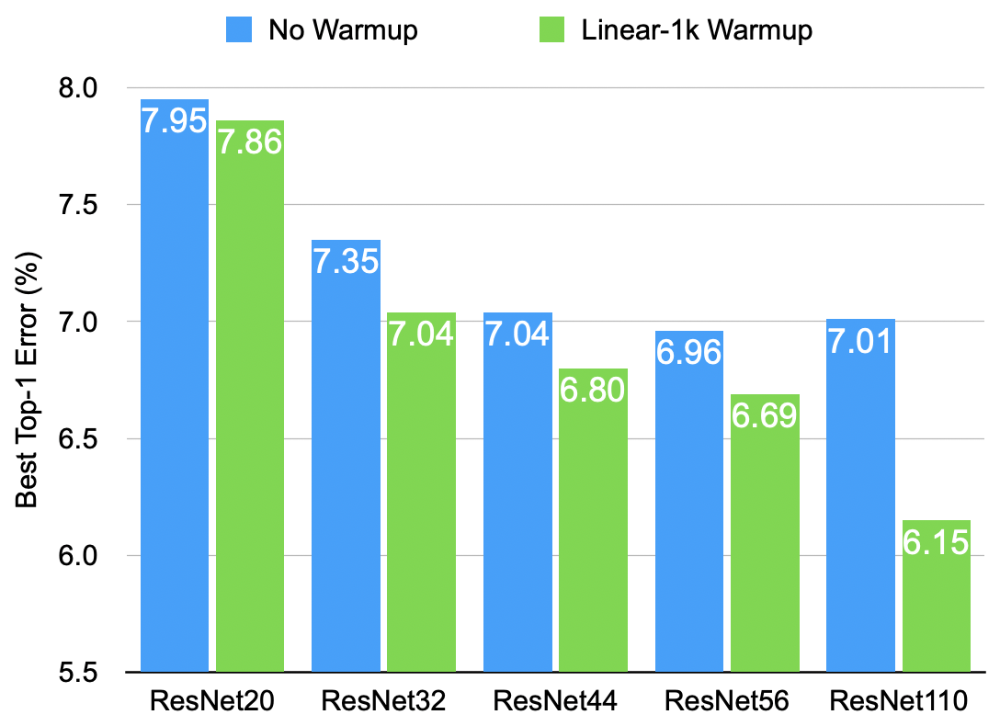</br>
  <i>The best top-1 errors of ResNet models trained by the SGD algorithm without warmup or with the Linear-1k warmup.</i>
</p>

<p align="center">
  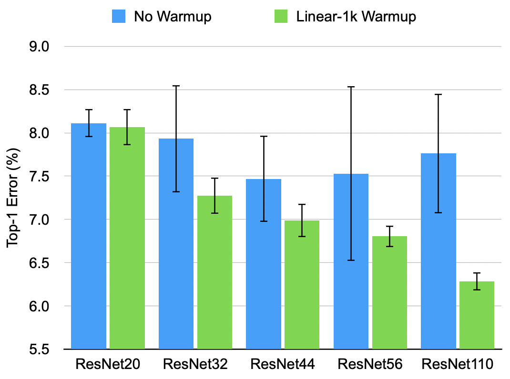</br>
  <i>Top-1 errors of ResNet models trained by the SGD algorithm without warmup or with the Linear-1k warmup.
    This bar chart presents the mean values. The error bar indicates the standard deviation.</i>
</p>

### SGD

The top-1 errors are shown as mean ± std.

| Architecture | No Warmup     | Linear-1k Warmup |
| ------------ | -------------:| ----------------:|
| ResNet20     | `8.11 ± 0.16` | `8.06 ± 0.21`    |
| ResNet32     | `7.93 ± 0.62` | `7.27 ± 0.21`    |
| ResNet44     | `7.47 ± 0.50` | `6.99 ± 0.19`    |
| ResNet56     | `7.53 ± 1.01` | `6.80 ± 0.12`    |
| ResNet110    | `7.76 ± 0.69` | `6.28 ± 0.10`    |

&copy; 2024-2025 Takenori Yamamoto