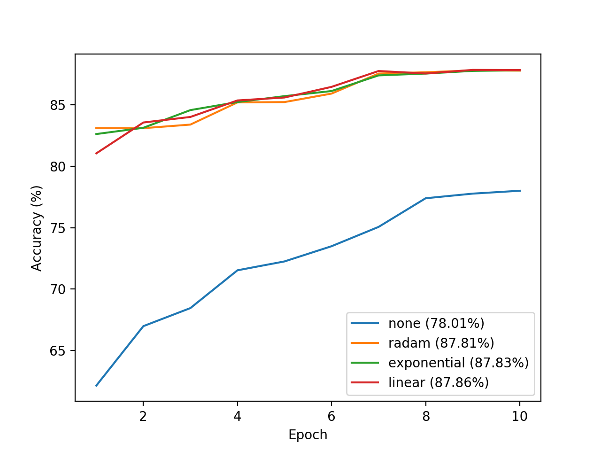
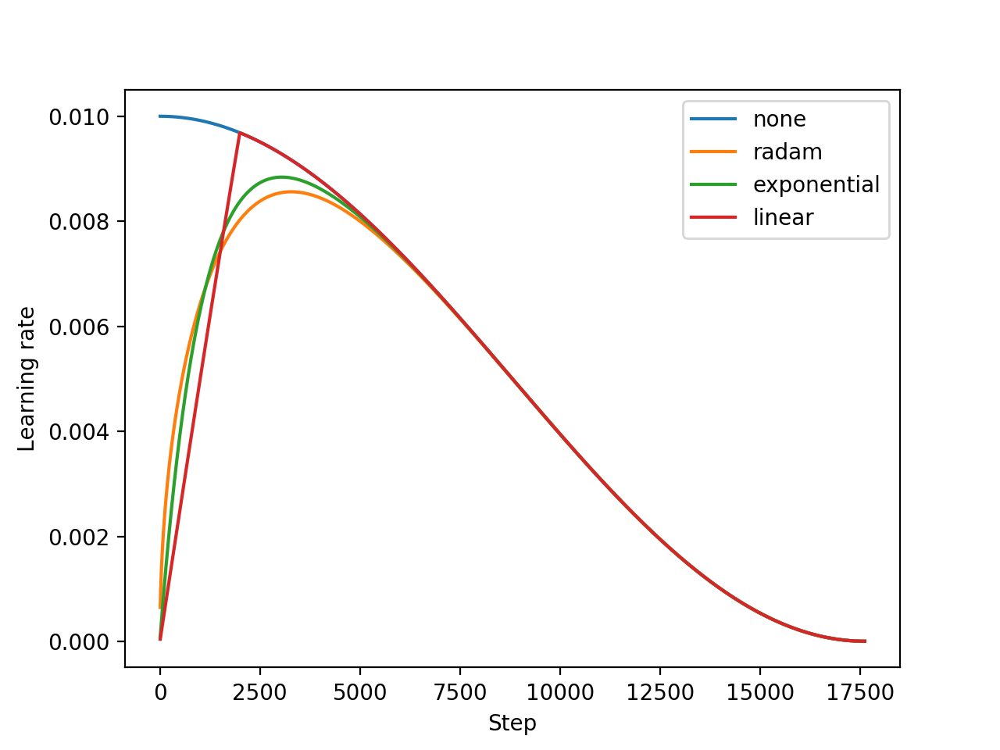
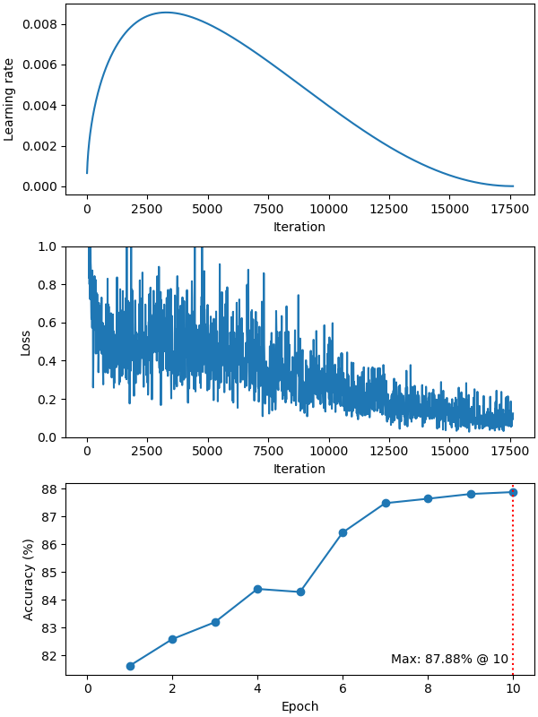

# EMNIST Example

Requirements: `pytorch_warmup` and `torchvision`.

## Results

<p align="center">
  </br>
  <i>Test accuracy over time for each warmup schedule.</i>
</p>

<p align="center">
  </br>
  <i>Learning rate over time for each warmup schedule.</i>
</p>

## Download EMNIST Dataset

Run the Python script `download.py` to download the EMNIST dataset:

```shell
python download.py
```

This script shows download progress:

```
Downloading zip archive
Downloading https://.../EMNIST/gzip.zip to data/EMNIST/raw/gzip.zip
100.0%
```

## Train CNN Models

Run the Python script `main.py` to train a CNN model on the EMNIST dataset using the AdamW algorithm.

> [!Note]
> Use `--workers` option to set the number of dataloader workers
> for a better performance in a GPU training.
> The optimal number depends on your environment.
> For example, 2 and 4 for a MPS and CUDA device, respectively,
> but it should not be more than the number of available performance cores.
> Note that the initial epoch takes more time than a later epoch if the number of workers is greater than 0.

The training log and the test evaluations are saved to files in a directory named `output_[warmup schedule name]`:

* `history.csv` - The training log.
* `evaluation.csv` - The test evaluations during training.
* `emnist_cnn.pt` - The current model (saved optionally).

You can visualize the training result using the Python script `plot.py`:

```
python plot.py [path to the directory]
```

This plot script requires `pandas` and `matplotlib`.

<p align="center">
  </br>
  <i>A training result for the AdamW algorithm with the RAdam warmup.</i>
</p>

### Untuned Linear Warmup

Train a CNN model with the *Untuned Linear Warmup* schedule:

```
python main.py --warmup linear
```

### Untuned Exponential Warmup

Train a CNN model with the *Untuned Exponential Warmup* schedule:

```
python main.py --warmup exponential
```

### RAdam Warmup

Train a CNN model with the *RAdam Warmup* schedule:

```
python main.py --warmup radam
```

### No Warmup

Train a CNN model without warmup:

```
python main.py --warmup none
```

> [!Warning]
> You may have a very different result from one shown in the figure
> because a training without warmup can become significantly unstable at a very early stage.
> The observed accuracies at the last epoch are 2%, 78%, 86%, etc.
> The figure's result was obtained on Apple M1 Pro chip without GPU acceleration.

## Usage

```
usage: main.py [-h] [--batch-size N] [--test-batch-size N] [--epochs N]
               [--lr LR] [--lr-min LM] [--wd WD] [--beta2 B2] [--seed S]
               [--log-interval N]
               [--warmup {linear,exponential,radam,none}] [--workers N]
               [--save-model] [--no-gpu]

PyTorch EMNIST Example

options:
  -h, --help            show this help message and exit
  --batch-size N        input batch size for training (default: 64)
  --test-batch-size N   input batch size for testing (default: 1000)
  --epochs N            number of epochs to train (default: 10)
  --lr LR               base learning rate (default: 0.01)
  --lr-min LM           minimum learning rate (default: 1e-5)
  --wd WD               weight decay (default: 0.01)
  --beta2 B2            Adam's beta2 parameter (default: 0.999)
  --seed S              random seed (default: 1)
  --log-interval N      how many batches to wait before logging training
                        status
  --warmup {linear,exponential,radam,none}
                        warmup schedule
  --workers N           number of dataloader workers for GPU training
                        (default: 0)
  --save-model          for saving the current model
  --no-gpu              disable GPU training. As default, an MPS or CUDA
                        device will be used if available.
```

```
usage: plot.py [-h] [--output {none,png,pdf}] PATH

Training History Plot

positional arguments:
  PATH                  path to the output directory of the training script

options:
  -h, --help            show this help message and exit
  --output {none,png,pdf}
                        output file type (default: none)
```

&copy; 2024 Takenori Yamamoto