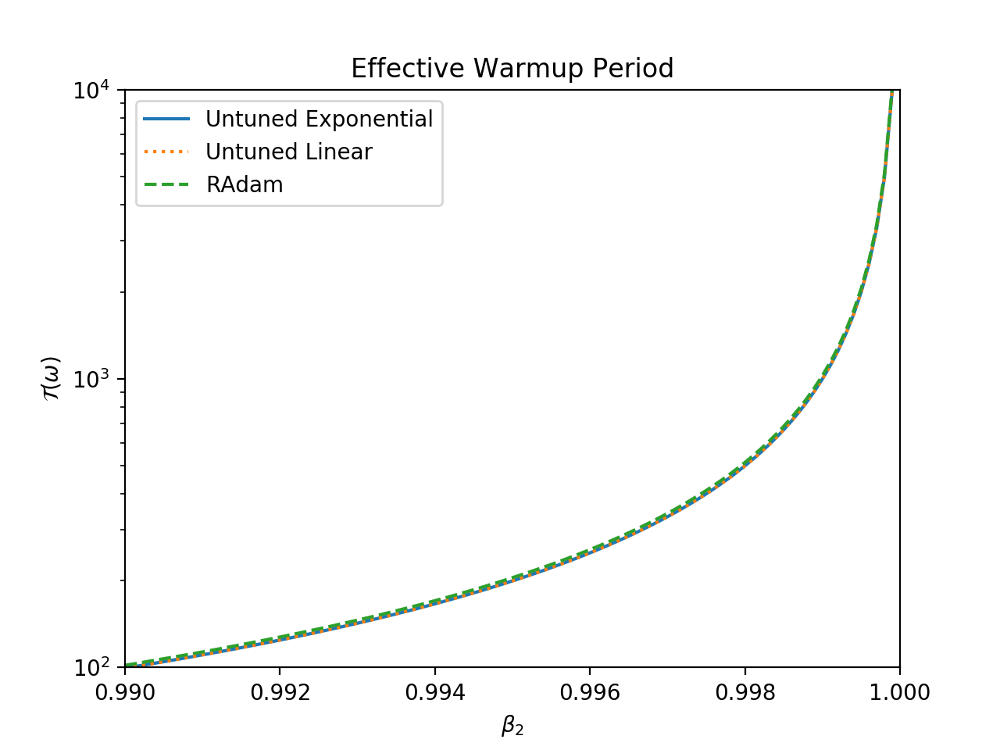
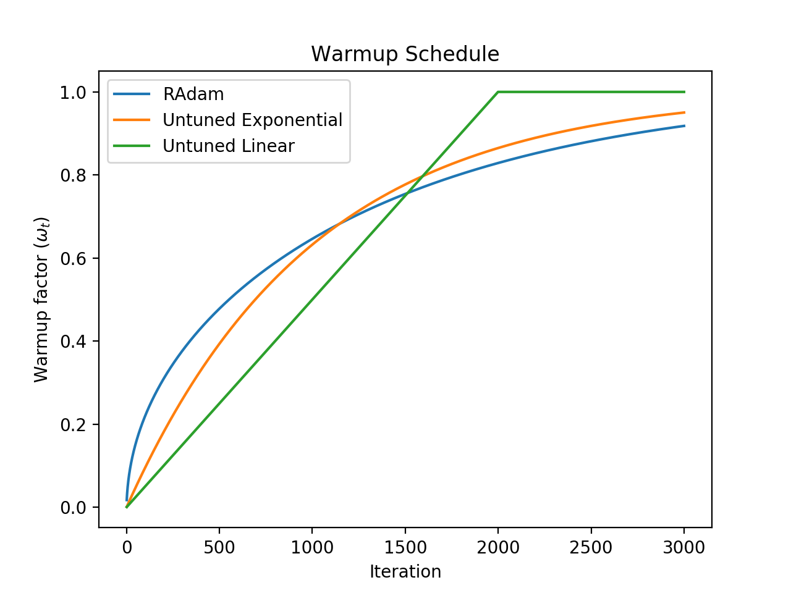

# Plots

Requirements: `pytorch_warmup` and `matplotlib`. 

## Effective Warmup Period

<p align="center">
  </br>
  <i>Effective warmup periods of RAdam and rule-of-thumb warmup schedules, as a function of &beta;&#8322;.</i>
</p>

Run the Python script `effective_warmup_period.py` to show up the figure above:

```shell
python effective_warmup_period.py
```

### Usage

```
usage: effective_warmup_period.py [-h] [--output {none,png,pdf}]

Effective warmup period

options:
  -h, --help            show this help message and exit
  --output {none,png,pdf}
                        Output file type (default: none)
```

## Warmup Schedule

<p align="center">
  </br>
  <i>RAdam and rule-of-thumb warmup schedules over time for &beta;&#8322; = 0.999.</i>
</p>

Run the Python script `warmup_schedule.py` to show up the figure above:

```shell
python warmup_schedule.py
```

### Usage

```
usage: warmup_schedule.py [-h] [--output {none,png,pdf}]

Warmup schedule

options:
  -h, --help            show this help message and exit
  --output {none,png,pdf}
                        Output file type (default: none)
```

&copy; 2024 Takenori Yamamoto